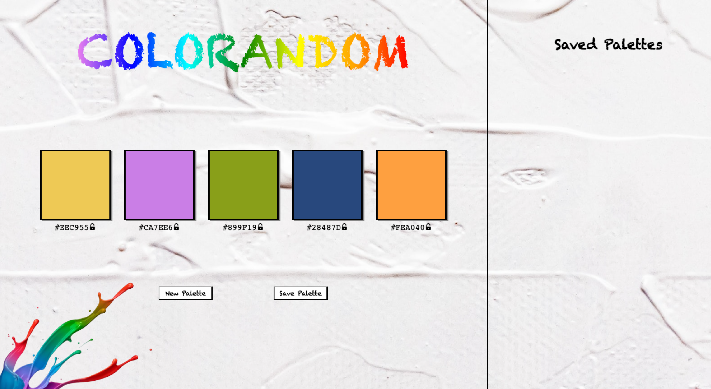
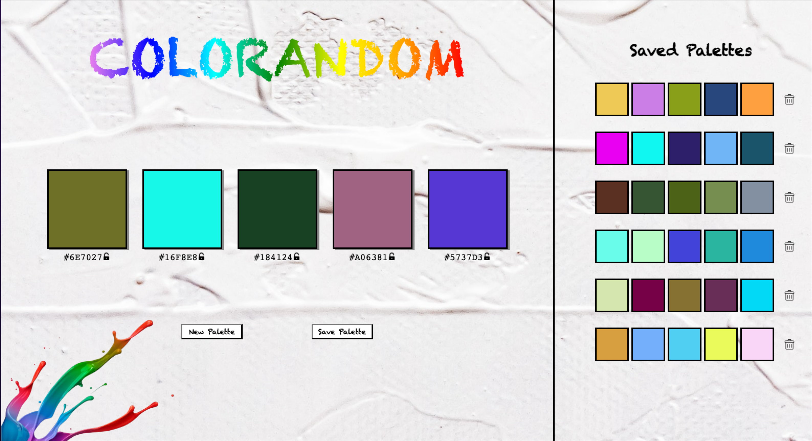

# ColoRandom
  
## Introduction
ColoRandom is a site that generates color palettes using random hex codes for us. Similar to other sites like [Coolors](https://coolors.co/), we present users with various random colors which they can choose to “save” (note: saved palettes will not persist across page refreshes).

The project spec & rubric can be found [here!](https://frontend.turing.edu/projects/module-1/colorandom-v2.html)

## Deployed Page
Visit our published ColoRandom [site!](https://forsethnico.github.io/random-colors/)

## Features
When you first visit the ColoRandom site you will be greeted with the title, a displayed palette of five colors that is generated at random using a combination of 16 letters and numbers that make up hex codes (A, B, C, D, E, F, 0-9), and then the hex code and lock symbol are displayed below the corresponding color. Users can also choose to “lock” a color by clicking the lock/unlock icon next to the hex code for a specific color, which will keep that color(s) 'locked' as a new palette of colors is generated.

 

Users can choose to save palettes they like and the palette will be moved to the "Saved Palettes" section on the right hand side of the page as a mini palette showing only the 5 colors. Users can also delete saved palettes they no longer want to keep by clicking the trash can icon next to the specified palette. 
 
 
This project will give our team an opportunity to write HTML and CSS, and leverage JavaScript to both create our data model and interact with the DOM. To enhance the CSS features we added a hover feature on the New and Save Palette buttons to change mouse cursor and background color of the button, added two overlaid background images, used a rainbow gradient for the title, and added a vertical scroll feature in the Saved Palettes section to allow the user to save as many palettes as they wish! It will also give our team an opportunity to practice Git workflow in a collaborative nature since this is our first group project. 

## Contributors
This website was built by a group of four front end engineering students with the [Turing School of Software and Design](https://turing.edu/). The following students are: 
  - [Colby Pearce](https://github.com/Crpearce)
  - [Hunter Monroe](https://github.com/Hmonroe2)
  - [Nick Liggett](https://github.com/NickLiggett)
  - [Nicole Forseth](https://github.com/forsethnico)
## Possible Future Extensions
  - Ensure all saved palettes are unique and allow the user to add a name to each saved palette.
  - Research hex codes to figure out how to programmatically generate random palettes that are cohesive and pleasant as currently it is generating colors completely at random. 
## Technologies
  - Javascript
  - HTML
  - CSS
## Sources
  - [MDN](http://developer.mozilla.org/en-US/)
  - [YouTube](https://www.youtube.com/)
  - [W3Schools](https://www.w3schools.com/)
